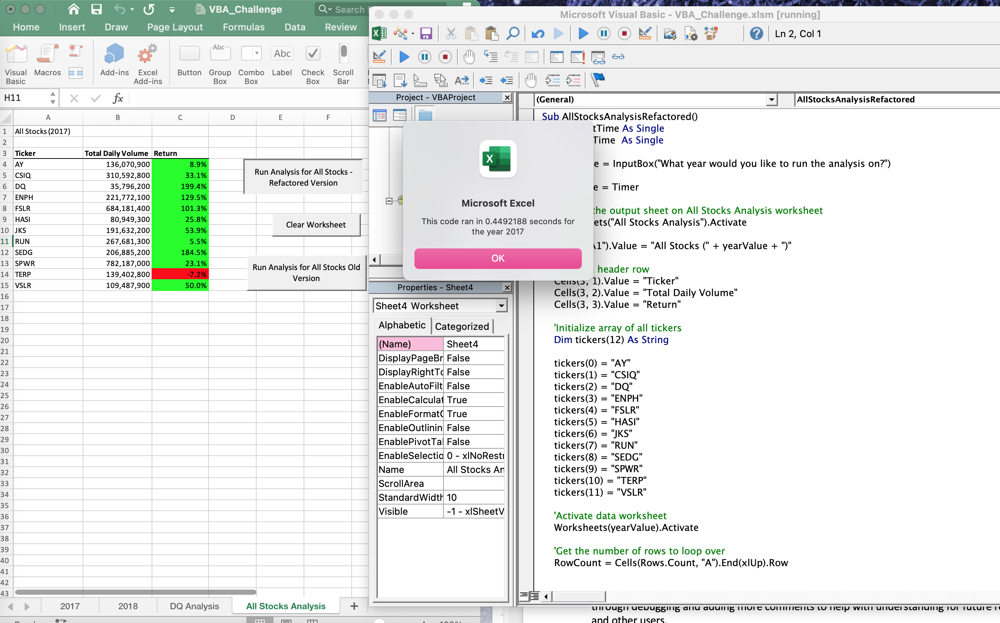
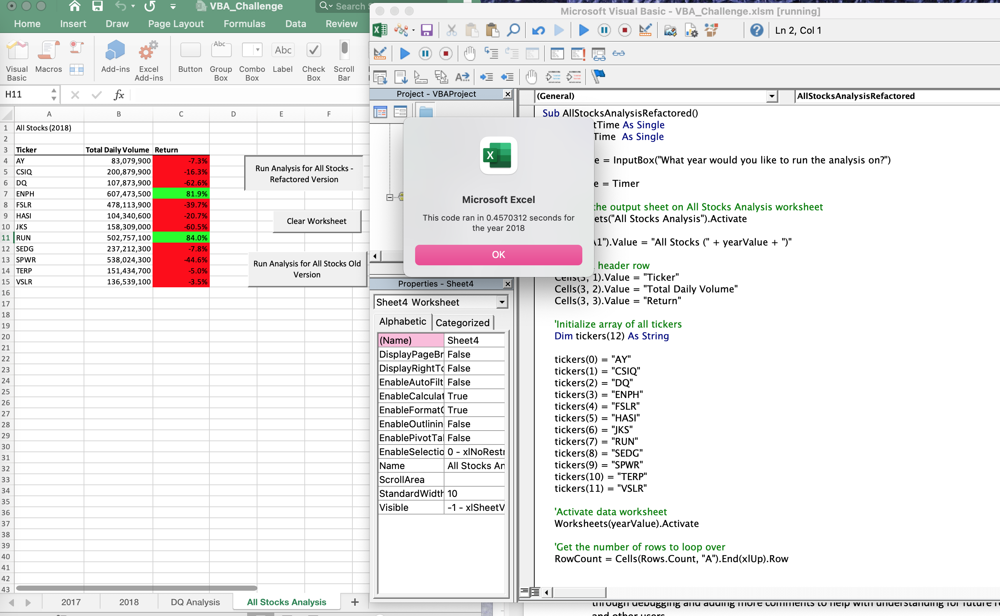

# Analysis of Refactored Code Results
## Overview of Project:
The purpose of this analysis was to write a script that would collect information no matter the size of the dataset. The final script was based on a previous script for a smaller dataset. With a provided starting point for the code, refactoring was performed to produce the final script and to find stock performance and execution times and therefore to determine if the refactoring made the VBA script run faster.
## Results:
To refactor the provided starting code, a new variable called "tickerIndex" was created. This "tickerIndex" variable referenced the existing ticker list already in the provided code. The code was able to be simplified to have one loop rather than any nested loops. This made the script easier to understand as well and comments were added to explain the "tickerIndex" reference. 

The stock performance was better in 2017, with only one stock having a negative return. In 2018, all but two stocks had a negative return. The execution times for the original script for both years was approximately .6 seconds while the refactored script runs at .4 seconds for both years. See the screenshots for the refactored script for both years here, which shows the execution times and the stock performance.  

## Summary:
Refactoring code makes the code more efficient. The advantages of refactoring code are the script will take fewer steps, use less memory and the logic of the code is improved to make it easier to understand and read. The disadvantages of refactoring code are that it may take a long time to figure out how to refactor it and if the developer does not understand the code or the purpose of the code the refactoring may be produced incorrectly. 

With the original VBA script, some of these advantages and disadvantages were present. The refactored code does take fewer steps and the logic is improved. But one of the risks when writing the refactored code was not understanding the new variable that was assigned and the code not having explaining the purpose of the code. This was worked through and corrected through debugging and adding more comments to help with understanding for future reference and other users.  
